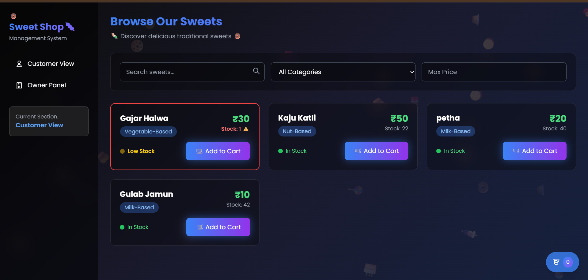
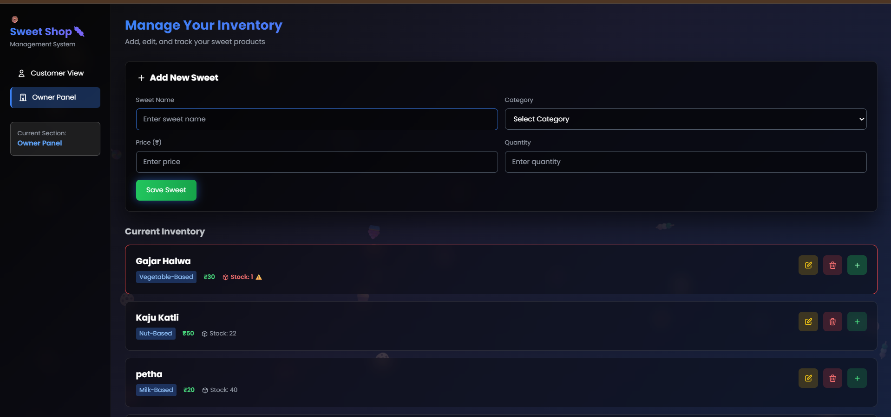

# 🍬 Sweet Shop Management System 🛒

A **Test-Driven Development (TDD)** based sweet shop management system built using:

* **Pure JavaScript**
* **IndexedDB** for local storage
* **Tailwind CSS** for styling
* **Jest** for testing

🔗 GitHub Repository: [Sweet Shop Management System](https://github.com/dhruv389/Incubyte-TDD-Sweet-Shop-Management-System)

---

## 📸 Demo & Preview

### 🖼️ UI Screenshots

| User View | Owner Dashboard |
|-----------|-----------------|
|  |  |

🎥 Video demo: *Coming Soon...*

---

## ✅ Key Features & Technology

| Features                        | Tech Stack            | Test Coverage     |
| ------------------------------- | --------------------- | ----------------- |
| ✔ Full CRUD for Sweets          | 💻 Vanilla JavaScript | ✅ 100% Coverage   |
| ✔ Separate User & Owner Modes   | 🎨 Tailwind CSS       | 🔍 50+ Test Cases |
| ✔ Offline Storage via IndexedDB | 🧪 Jest Unit Testing  | 📊 CI/CD Ready    |
| ✔ Responsive & Lightweight UI   | 🏗️ TDD Methodology   |                   |

---

## 🚀 Getting Started in 5 Steps

1. **Clone the Repository**

```bash
git clone https://github.com/dhruv389/Incubyte-TDD-Sweet-Shop-Management-System.git
cd Incubyte-TDD-Sweet-Shop-Management-System
```

2. **Install Dependencies**

```bash
npm install
```

3. **Run Tests**

```bash
npm test            # Run all test cases
npm run test:watch  # Watch mode (TDD)
npm run test:coverage  # Generate coverage report
```

---


## 📊 Test Report

After running tests with `jest-html-reporter`, open the following file in your browser to view a detailed HTML test report:

`test-report.html`

---

## 📸 Front-End

A basic front-end interface is available at :
`index.html`


### 👉 To view the front-end using Live Server:

1. Open the project folder in **VS Code**
2. Right-click on `index.html`
3. Click **"Open with Live Server"**
4. The page will open in your browser at:  
http://127.0.0.1:5500/index.html

(or a similar local URL)

💡 **Make sure you have the [Live Server](https://marketplace.visualstudio.com/items?itemName=ritwickdey.LiveServer) extension installed in VS Code.**
EOF

---

## 🧾 Project Structure

```
📁 Sweet-Shop-Management-System/
├── 📂 src/
│   ├── Animation.js         # Animation utilities
│   ├── CartManager.js       # Manages cart logic
│   ├── DatabaseManager.js   # IndexedDB setup and queries
│   ├── SweetManager.js      # CRUD operations for sweets
│   └── UIManager.js         # UI rendering functions
│
├── 📂 test/
│   ├── cart-manager.test.js
│   ├── database-manager.test.js
│   ├── sweet-manager.test.js
│   └── setup.js             # Jest setup and mocks
│
├── index.html               # Main HTML file
|--- test-report.html        # test report
├── style.css                # Tailwind & custom styles
└── package.json             # Project metadata and scripts
```

---

## 🔍 Testing Highlights

| Feature          | Test Cases | Coverage |
| ---------------- | ---------- | -------- |
| Add Sweets       | 12         | ✅ 100%   |
| Delete Sweets    | 8          | ✅ 100%   |
| View Sweets      | 6          | ✅ 100%   |
| Search & Filter  | 10         | ✅ 100%   |
| Purchase/Restock | 9          | ✅ 100%   |
| Input Validation | 5          | ✅ 100%   |

### Why Jest?

* Fast and reliable testing engine 🚀
* Snapshot testing 📸
* Built-in mock support 🔁
* Code coverage built-in 📊

---

## 💾 IndexedDB for Storage

* Local, browser-based NoSQL storage
* Supports structured data with key-value pairs
* Asynchronous APIs = smooth performance
* No backend required

📌 How to view:

1. Open browser DevTools (F12)
2. Go to `Application > IndexedDB`
3. Locate database `SweetShopDB`

---

## 🎨 UI Overview

### 👤 User Section

* 🍭 Browse sweets by category
* 🔍 Search sweets by name or price
* 🛒 Add to cart functionality

### 🧑‍💼 Owner Section

* ✨ Add/Edit/Delete sweets
* 📦 Restock inventory
* ⚠️ Field validation for accuracy

### Styling Highlights

* Built using **Tailwind CSS**
* Fully responsive (mobile/tablet/desktop)
* Clean, modern look with minimal overhead

---

## 🤝 How to Contribute

1. Fork the project
2. Create a new branch

```bash
git checkout -b feature/YourFeatureName
```

3. Commit your changes

```bash
git commit -m "Add: YourFeatureName"
```

4. Push and create a pull request

```bash
git push origin feature/YourFeatureName
```

---

## 📜 License & Credits

* Licensed under the MIT License
* Built by **Dhaval Rathod**

📧 Email: [drcoder389@gmail.com](mailto:drcoder389@gmail.com)
🌐 GitHub: [@dhruv389](https://github.com/dhruv389)
